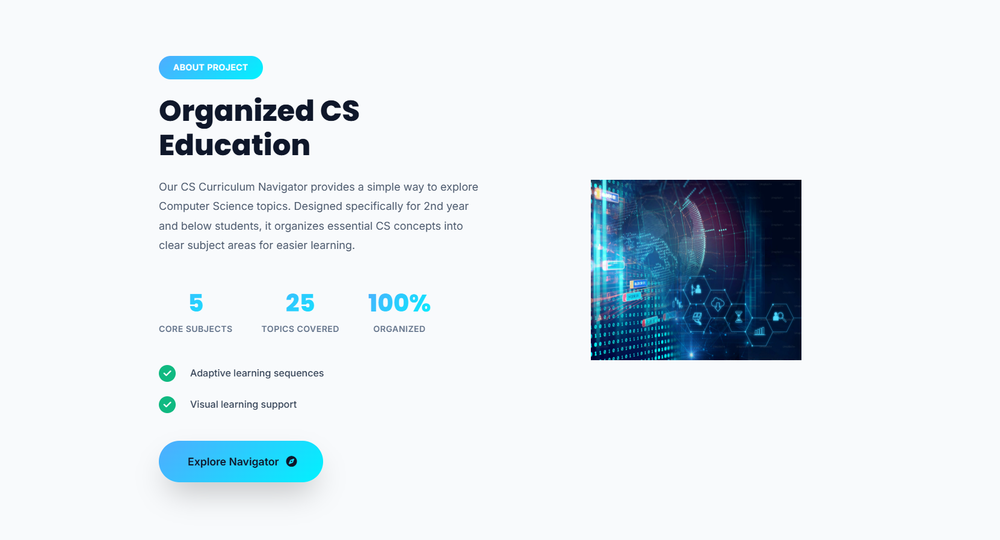
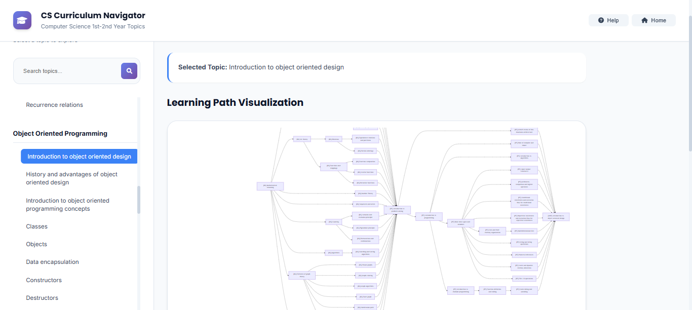
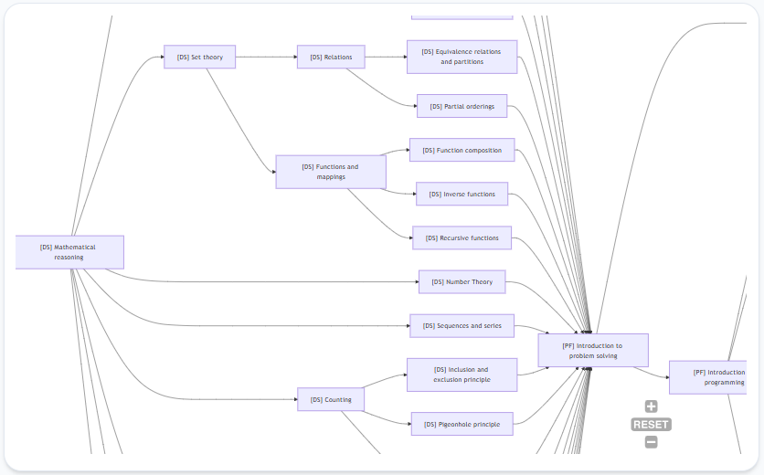
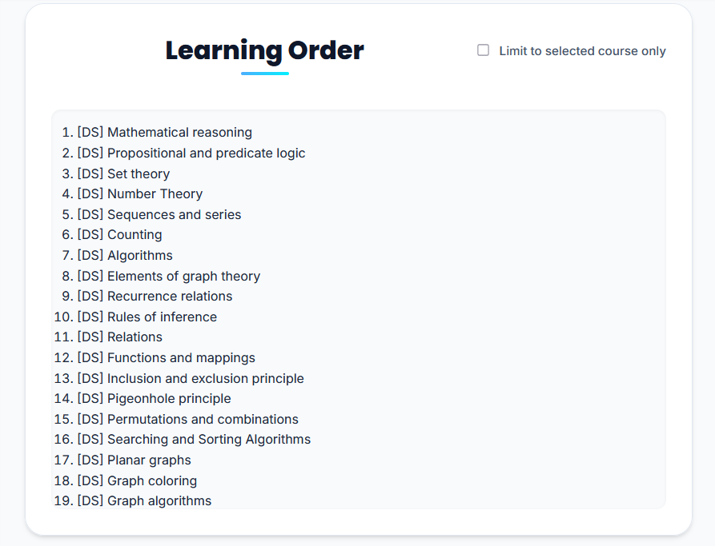
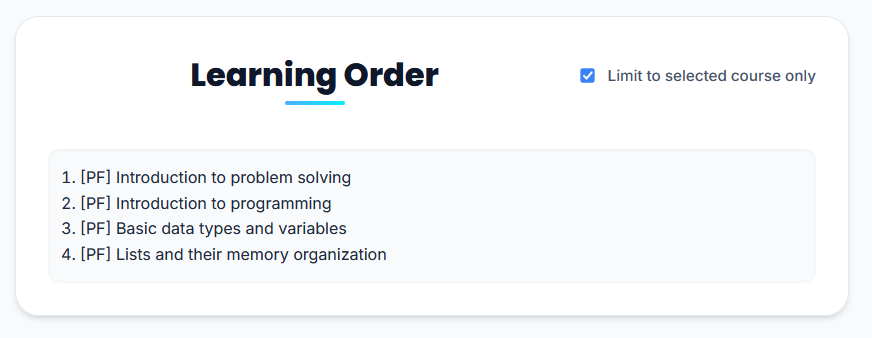

# Project Overview
Identification of curriculum of a course for self-learning Computer Science students using topological sort.

A tool that generates a structured and logical curriculum for self-learning students by identifying and arranging course topics using **topological sorting**, resulting in a flowchart representation of prerequisite and corequisites of a course.

___

## Project UI Overview

#### Homepage:

<br>
<br>

#### Features:

<br>
<br>

#### About:

<br>
<br>

#### Curriculum Navigator:



_Graphical visualization of all topic dependencies a certain course topic has. In this graph, the selected topic is "Introduction to object oriented design" under "Object Oriented Programming._
<br>
<br>
<br>



_Zoomed in view of graph visualization_
<br>
<br>

#### Learning Order (from graph):


_Enlists all topics that the specified course topic is dependent on._
<br>
<br>

#### Learning Order (Limited to selected course only):


_The list of topics is narrowed down to only the topics that is directly under the specified course when the "Limit to selected course only" option is toggled._
<br>
<br>

#### Help UI:

<br>
<br>

#### Team Members:

<br>
<br>

___

## Core Processes Methodology
1. **Curation** of computer science topics and defined prerequisites based off of an existing open curriculum.
2. **Format curated data** into information easily processable by the graph building algorithm.
3. **Construction** of the pre-sorted graph.
4. **Return** a topologically sorted graph to the user based on the user specified learning path. 
5. **Create graph visualizations** after graph processing


___

## Data Curation Details

#### Sources:
The process of curating the core computing subjects is Derived from CS2023: ACM/IEEE-CS/AAAI Computer Science Curricula– these are data that is based from an existing computer science curriculum which is publicly accepted.


In addition, the project also used a pre-existing curriculum based off of the revised curriculum for computing disciplines from the Higher Education Commission of the Government of Pakistan, Islamabad 2023
<br>

CS2023: https://csed.acm.org/

HEC Computing Disciplines 2023: https://nceac.org.pk/Documents/Curriculums/BS%20Curriculm%20Computing%20Disciplines-2023.pdf
<br>
<br>

#### Computer Science Topics Collected:
The project narrowed down its data collection to 1st Year to 2nd Year Computer Science topics. 

| Course Code | Course Name |
|-----------|-----------|
| PF    | Programming Fundamentals |
| DS    | Discrete Structures |
| OOP   | Object Oriented Programming |
| DBS   | Database Systems |
| DLD   | Digital Logic Design |
| DSA   | Data Structures |
| CN    | Computer Networks |
| OS    | Operating Systems | 
| AoA   | Analysis of Algorithms |
<br>

#### Adding More Topics:
All course topics are listed in the [graph.json](./public/data/graph.json) file. Future addition of topics only require adding the necessary nodes and connections in the json.

```javascript
{
    "nodes": [
        { "id": "[PF] Introduction to problem solving" },
        { "id": "[PF] A brief review of Von-Neumann architecture" },
        { "id": "[PF] Introduction to programming" }
    ],
     "links": [
        { 
            "source": "[PF] Introduction to problem solving", 
            "target": "[PF] A brief review of Von-Neumann architecture" },
        { 
            "source": "[PF] Introduction to problem solving", 
            "target": "[PF] Introduction to programming" },
        { 
            "source": "[PF] Introduction to programming", 
            "target": "[PF] Role of compiler and linker" },
        { 
            "source": "[PF] Introduction to programming", 
            "target": "[PF] Introduction to algorithms" 
        }
    ]
}
```
___

## Installing dependencies and running the project
To install dependencies, run: 
```
npm install
```

To get started, run:
```
npm run devStart
```


